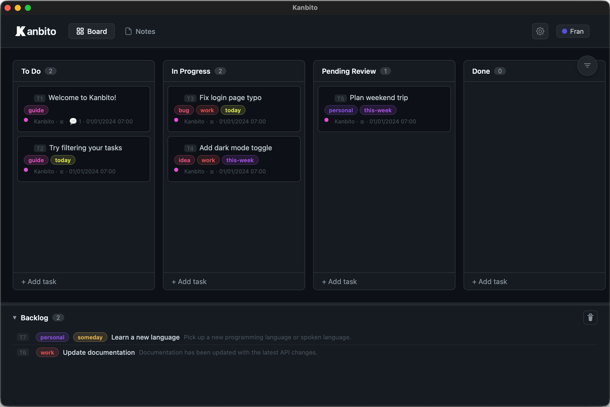

<p align="center">
  
</p>

<h1 align="center">Kanbito</h1>

<p align="center">
  <strong>A simple, free to-do list for your desktop</strong><br>
  Organize tasks visually, take notes, sync across devices. No account needed. 20 languages.
</p>

<p align="center">
  <a href="https://github.com/vfmatzkin/kanbito/releases/latest"></a>
  <a href="https://github.com/vfmatzkin/kanbito/releases"></a>
  <a href="LICENSE"></a>
  <a href="https://kanbito.tzk.ar"></a>
</p>

<p align="center">
  <a href="https://buymeacoffee.com/tzk.ar"></a>
  <a href="https://cafecito.app/tzk_ar"></a>
</p>

<p align="center">
  <a href="https://kanbito.tzk.ar">Website</a> •
  <a href="https://github.com/vfmatzkin/kanbito/releases/latest">Download</a> •
  <a href="#features">Features</a> •
  <a href="#installation">Install</a> •
  <a href="#contributing">Contribute</a>
</p>



## Features

- **Kanban Board**: Organize tasks in customizable columns (To Do, Doing, Done)
- **Subtasks**: Create hierarchical task structures
- **Notes**: Separate notes section with tree organization
- **Markdown Support**: Write descriptions and comments in Markdown
- **Tags**: Color-coded tags for task categorization
- **Comments**: Add comments to tasks with user attribution
- **Cross-references**: Link tasks and notes with `[[T1]]` or `[[N1]]` syntax
- **Image Paste**: Paste images directly into descriptions
- **Git Sync**: One-click sync with Git (commit, pull, push)
- **System Tray**: Minimize/close to tray on Windows/Linux (macOS uses Dock)
- **Local Storage**: All data stored as JSON and Markdown files in `~/Documents/Kanbito`

## Installation

### Option 1: Download Binary (Recommended)

Download the latest release for your platform from [Releases](https://github.com/vfmatzkin/kanbito/releases/latest):

| Platform | Download | Notes |
|----------|----------|-------|
| **macOS** | `Kanbito-macOS.dmg` | Mount and drag to Applications |
| **Windows** | `Kanbito-Windows.exe` | Run directly, no install needed |
| **Linux** | `Kanbito-Linux` | Make executable: `chmod +x Kanbito-Linux` |

### Option 2: Install with uv/pip

```bash
# With uv
uv tool install git+https://github.com/vfmatzkin/kanbito

# With pip
pip install git+https://github.com/vfmatzkin/kanbito
```

Then run:

```bash
kanbito
```

### Option 3: Run from Source

```bash
git clone https://github.com/vfmatzkin/kanbito
cd kanbito
uv run kanbito
```

## Usage

1. **Open Kanbito** from your Applications folder, Start Menu, or Spotlight
2. **Create tasks** by clicking "+ Add task" in any column
3. **Drag and drop** tasks between columns
4. **Double-click** a task to view details, add comments, or create subtasks
5. **Switch to Notes** tab for longer-form documentation
6. **Click Sync** to commit and push changes to Git

### Data Storage

Kanbito stores all your data in `~/Documents/Kanbito`:

| Platform | Location |
|----------|----------|
| **macOS** | `/Users/<you>/Documents/Kanbito` |
| **Windows** | `C:\Users\<you>\Documents\Kanbito` |
| **Linux** | `/home/<you>/Documents/Kanbito` |

```
~/Documents/Kanbito/
├── board.json       # Task metadata
├── notes.json       # Notes metadata
├── .kanbito.json    # Settings (language, git config, etc.)
├── tasks/           # Task descriptions (T1.md, T2.md, ...)
├── notes/           # Note content (N1.md, N2.md, ...)
└── images/          # Pasted images
```

This folder is automatically created on first launch. You can sync it with Git to back up your data or share across devices.

#### Custom Data Directory

You can change the data location using any of these methods (in priority order):

1. **Command line**: `kanbito --data-dir ~/MyProjects/MyBoard`
2. **Environment variable**: `export KANBITO_DATA_DIR=~/MyProjects/MyBoard`
3. **Config file**: Create `~/.kanbito-config` containing the path:
   ```
   ~/MyProjects/MyBoard
   ```

### Git Sync

Sync your tasks across multiple computers using GitHub. This is optional but recommended for backup.

#### Setting Up Sync

1. **Create a private repository** on GitHub:
   - Go to [github.com/new](https://github.com/new)
   - Name it something like `my-kanbito` or `tasks`
   - **Choose "Private"** (recommended for privacy - your tasks won't be visible to others)
   - Click "Create repository"

2. **Connect Kanbito to your repo**:
   - Open Kanbito → Settings (gear icon)
   - Paste your repository URL (e.g., `https://github.com/yourusername/my-kanbito`)
   - Click "Setup Git"
   - Authenticate with GitHub when prompted

3. **Sync your tasks**:
   - Click the "Sync" button in the header whenever you want to save
   - The number shows how many changes are pending

#### How It Works

- Your tasks are stored as simple files in `~/Documents/Kanbito`
- Sync does: `git add . && git commit && git pull --rebase && git push`
- Works with any Git hosting (GitHub, GitLab, etc.)
- **Private repos** keep your tasks visible only to you

## Development

```bash
# Clone the repo
git clone https://github.com/vfmatzkin/kanbito
cd kanbito

# Install dependencies
uv sync

# Run in development mode (shows as "Python" in taskbar)
uv run python -m kanbito

# Run with debug tools (right-click inspect)
uv run python -m kanbito --debug

# Run in browser mode
uv run python -m kanbito --browser

# Disable system tray (close button quits instead of hiding)
uv run python -m kanbito --no-tray
```

## Building

To get the proper app icon and name in the taskbar/dock, build a standalone binary:

### macOS

```bash
uv run pyinstaller --noconsole --onefile --name Kanbito \
  --icon assets/kanbito.icns \
  src/kanbito/__main__.py \
  --add-data "src/kanbito/static:kanbito/static"

# Run it
open dist/Kanbito.app

# Or install to Applications
cp -r dist/Kanbito.app /Applications/
```

### Windows

```bash
uv run pyinstaller --noconsole --onefile --name Kanbito ^
  --icon assets/kanbito.ico ^
  src/kanbito/__main__.py ^
  --add-data "src/kanbito/static;kanbito/static"

# Run it
dist\Kanbito.exe
```

### Linux

```bash
# Install system dependencies first
sudo apt install libgtk-3-dev libwebkit2gtk-4.0-dev libayatana-appindicator3-dev

uv run pyinstaller --noconsole --onefile --name Kanbito \
  src/kanbito/__main__.py \
  --add-data "src/kanbito/static:kanbito/static"

# Run it
./dist/Kanbito
```

## Requirements

- Python 3.10+
- Flask 3.0+
- PyWebView 5.0+
- pystray (for system tray)
- Pillow (for tray icon)

---

## Contributing

Contributions are welcome! Whether it's bug fixes, new features, translations, or documentation improvements.

### Reporting Issues

Before opening an issue:
1. Search [existing issues](https://github.com/vfmatzkin/kanbito/issues) to avoid duplicates
2. Include your OS, Python version, and how you installed Kanbito
3. For bugs, provide steps to reproduce

### Pull Requests

1. Fork the repository
2. Create a feature branch: `git checkout -b feature/your-feature`
3. Make your changes
4. Test locally with `uv run python -m kanbito --debug`
5. Commit with clear messages
6. Push and open a PR against `main`

### Project Structure

```
kanbito/
├── src/kanbito/
│   ├── app.py              # Entry point, PyWebView window
│   ├── server.py           # Flask backend, API routes
│   ├── git_sync.py         # Git/GitHub sync logic
│   └── static/
│       ├── app.js          # Kanban board frontend
│       ├── notes.js        # Notes section frontend
│       ├── i18n.js         # Internationalization setup
│       ├── style.css       # All styling
│       └── locales/        # Translation files (20 languages)
├── pyproject.toml          # Dependencies & build config
└── README.md
```

### Adding Translations

Kanbito supports 20 languages via [i18next](https://www.i18next.com/). To add or improve a translation:

#### Adding a New Language

1. Copy `src/kanbito/static/locales/en.json` to `{lang-code}.json`
2. Translate all values (keep the keys unchanged)
3. Register the language in `src/kanbito/static/i18n.js`:
   ```javascript
   const LANGUAGES = {
     // ... existing languages
     xx: '🇽🇽 Language Name',  // Add your language
   };
   ```
4. For RTL languages (Arabic, Hebrew, etc.), add the code to `RTL_LANGUAGES`
5. Add the language option in `src/kanbito/server.py` (search for `languageSelect`)

#### Translation File Structure

```json
{
  "welcome": { ... },      // Welcome wizard
  "app": { ... },          // App chrome (Board, Notes tabs)
  "task": { ... },         // Task-related UI
  "columns": { ... },      // Column names (To Do, Doing, etc.)
  "notes": { ... },        // Notes section
  "settings": { ... },     // Settings panel
  "git": { ... },          // Git sync status messages
  "conflict": { ... },     // Merge conflict dialog
  "examples": {            // Example content for new users
    "tasks": { ... },
    "notes": { ... }
  }
}
```

#### Translation Tips

- Use `{{variable}}` for interpolation (e.g., `"{{count}} tasks"`)
- Keep Markdown formatting in example content
- Test your translation by changing the language in Settings

#### Currently Supported Languages

| Language | Code | RTL |
|----------|------|-----|
| English | `en` | |
| Spanish (Rioplatense) | `es` | |
| French | `fr` | |
| German | `de` | |
| Italian | `it` | |
| Portuguese | `pt` | |
| Russian | `ru` | |
| Polish | `pl` | |
| Turkish | `tr` | |
| Chinese | `zh` | |
| Japanese | `ja` | |
| Korean | `ko` | |
| Hindi | `hi` | |
| Bengali | `bn` | |
| Indonesian | `id` | |
| Vietnamese | `vi` | |
| Arabic | `ar` | Yes |
| Hebrew | `he` | Yes |
| Persian | `fa` | Yes |
| Urdu | `ur` | Yes |

### Contribution Ideas

**Good First Issues:**
- Fix typos or improve translations
- Add keyboard shortcuts
- Improve error messages
- Add tooltips to buttons

**Feature Ideas:**
- Export to PDF/Markdown/CSV
- Task templates
- Full-text search across tasks and notes
- Additional color themes
- Due dates and reminders
- Task duplication
- Offline conflict resolution improvements

**Code Quality:**
- Add unit tests (pytest for backend, Jest for frontend)
- Add JSDoc type annotations
- Improve accessibility (ARIA labels, keyboard navigation)
- Performance optimization for large boards

### Code Style

- **Python**: Follow PEP 8, use type hints where helpful
- **JavaScript**: Vanilla JS, no frameworks; use `const`/`let`, async/await
- **CSS**: Use CSS variables for theming, BEM-ish naming
- **Commits**: Clear, concise messages describing the change

### API Reference

The Flask backend exposes these endpoints:

| Endpoint | Method | Description |
|----------|--------|-------------|
| `/api/board` | GET/POST | Fetch/save board state |
| `/api/notes` | GET/POST | Fetch/save notes state |
| `/api/settings` | GET/POST | Fetch/save user settings |
| `/api/git/status` | GET | Git repository status |
| `/api/git/sync` | POST | Execute git sync |
| `/api/git/setup` | POST | Configure git remote |
| `/api/images/<id>` | POST | Upload images |

---

## License

MIT License - see [LICENSE](LICENSE) for details.
